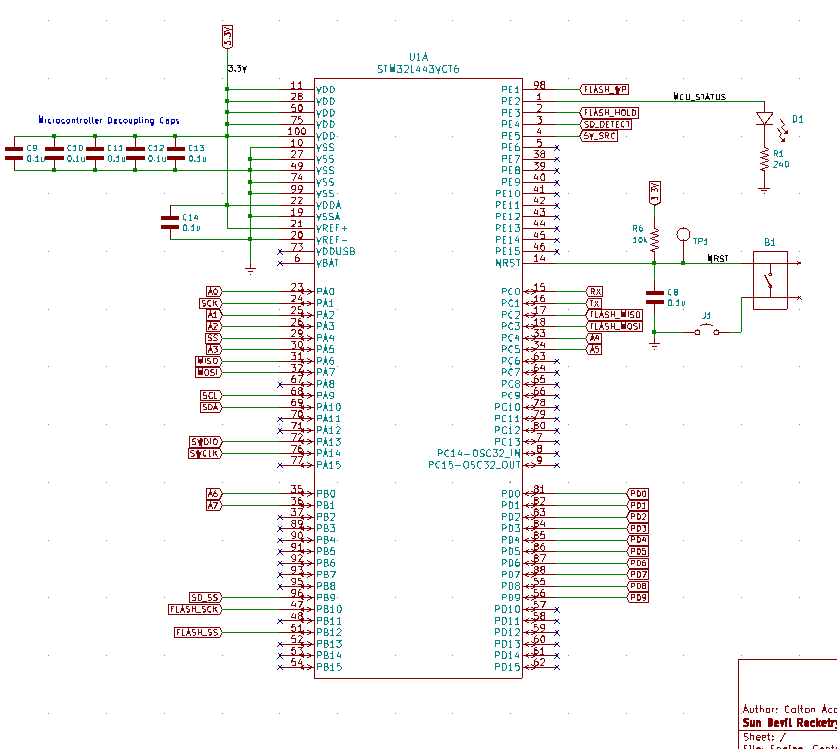
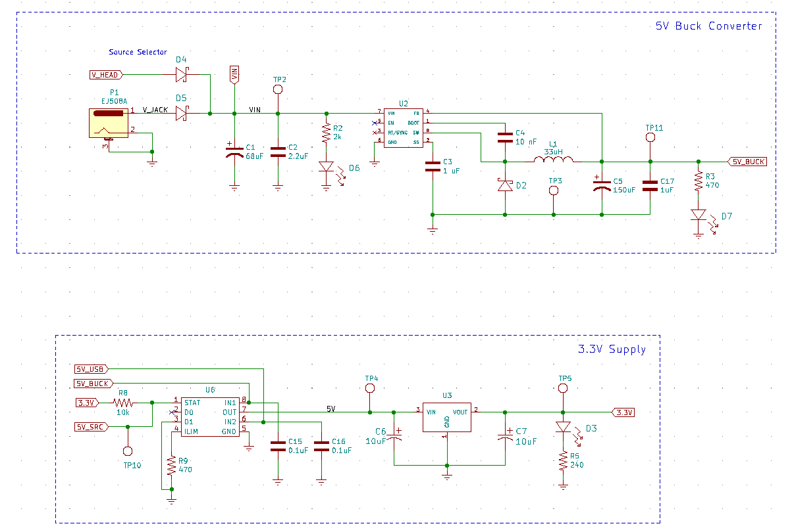
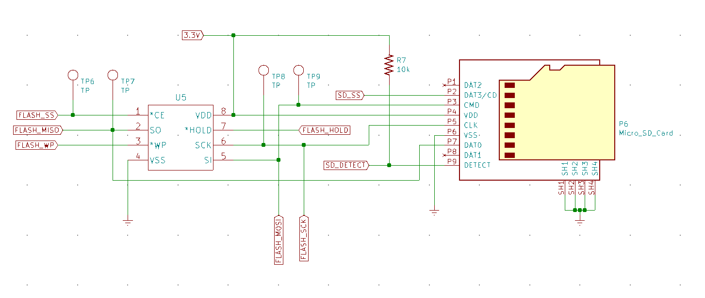
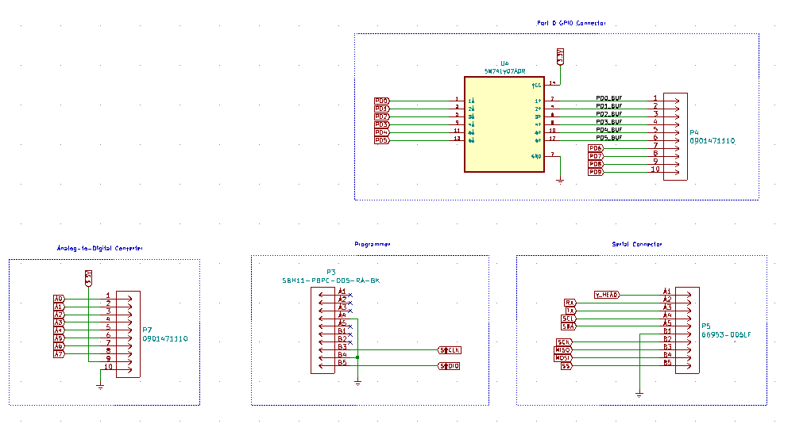
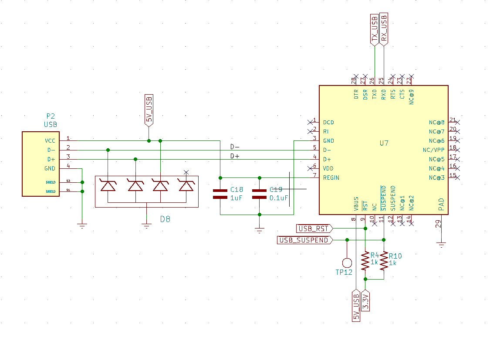
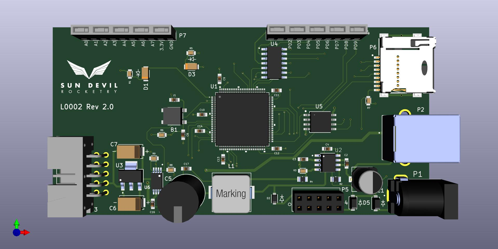
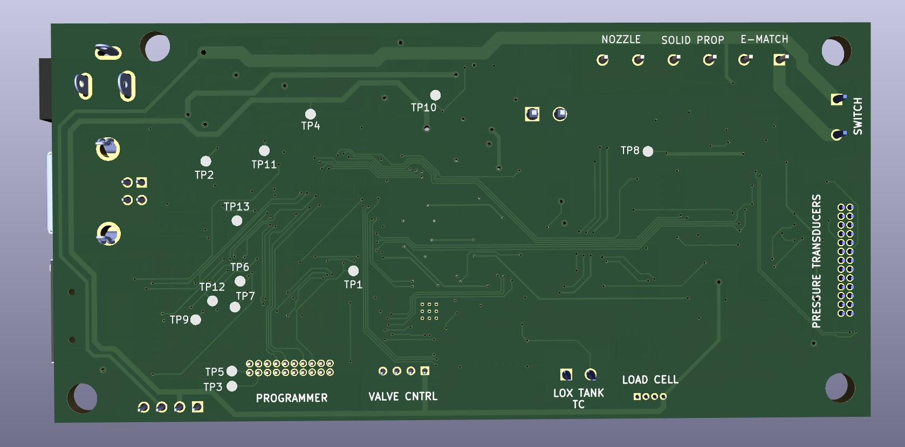

<h1>Liquids Engine Controller</h1>

Current PCB Revision: 2.0

PCB Part Number: L0002

The Liquids Engine Controller PCB is the main embedded processor of SDR's 
 Liquid Engine. The Controller is equipped wth an STM32 ARM Cortex M4 processor 
 and 4Mb of external flash for data logging. The board includes a micro-SD card 
 jack for easy access to the logged data. The board includes many power sources 
 for flexible use of the controller during testing and normal operation. These 
 inlcude a 12V power jack, a USB Type B connector, and female header pins which 
 are regulated down to 5V and 3.3V with a buck converter and linear regulator 
 power supply. Additionally, the board includes a reset button and several LEDs 
 for visual indication of the power and firmware status of the controller. 

<b>Working Directory Structure:</b>

   doc: documentation
   
   src: source design files, e.g. schematic and PCB layout files

   lib: libraries for schematic symbols and footprints

   production: files needed for pcb fabrication, e.g. gerbers, profile, drill file

   sim: simulation files 

   cad: 3d models
  
   img: images of circuit/footprints for github display 

<h2>Schematic: </h2>

<h3>Microcontroller:</h3>

<h3>Power Supply: </h3>

<h3>Data Logger: </h3>

<h3>Connectors: </h3>

<h3>USB: </h3>

<h2>PCB: </h2>

