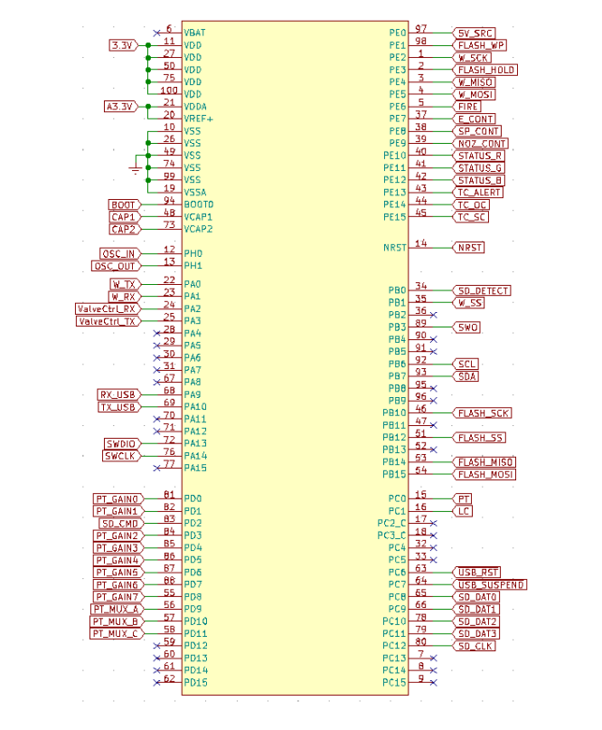
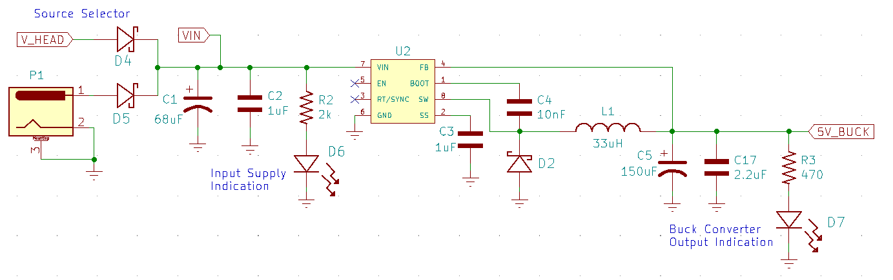
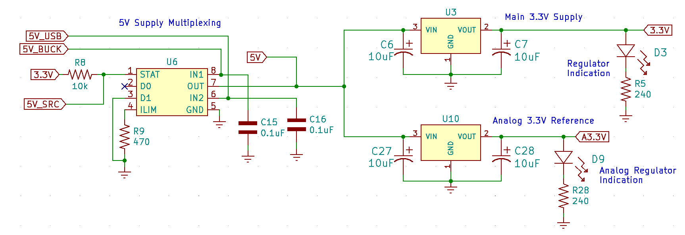
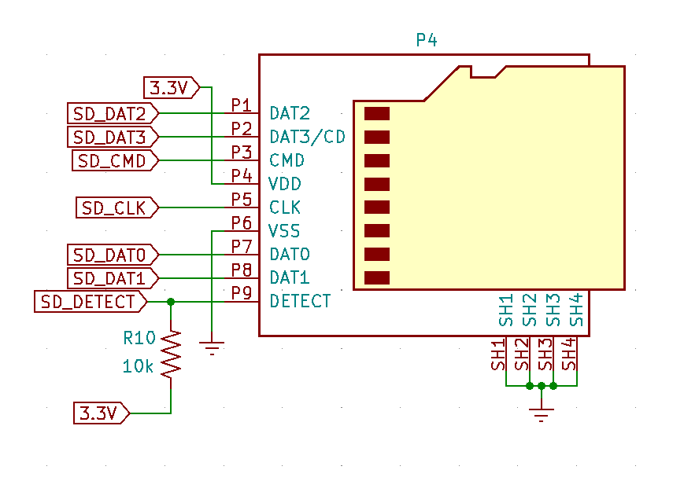
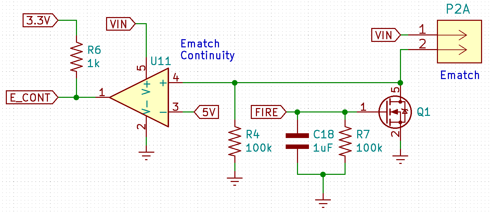
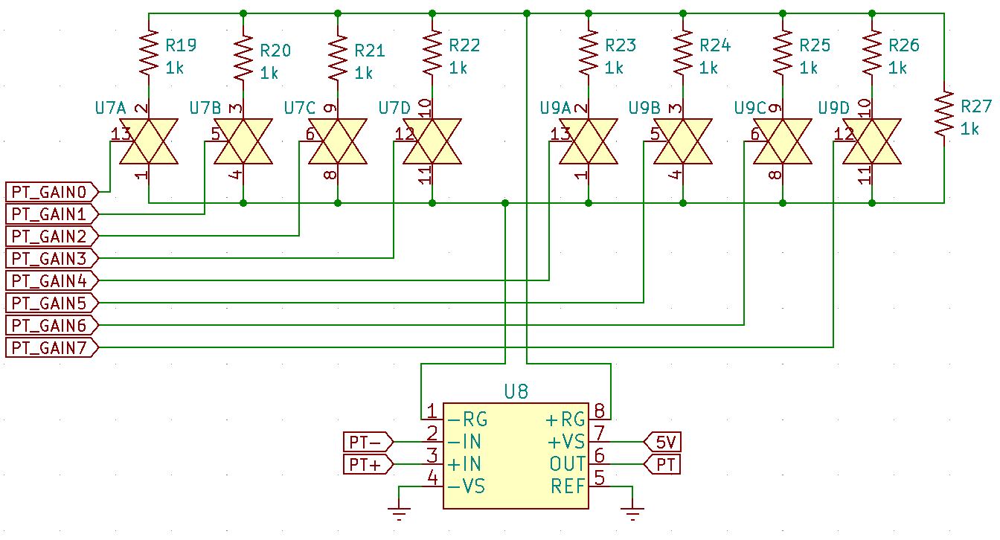
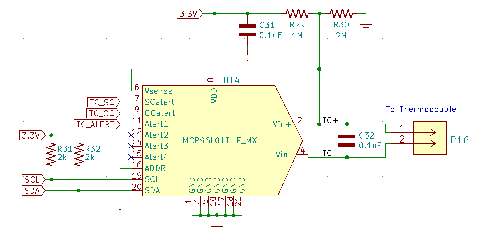
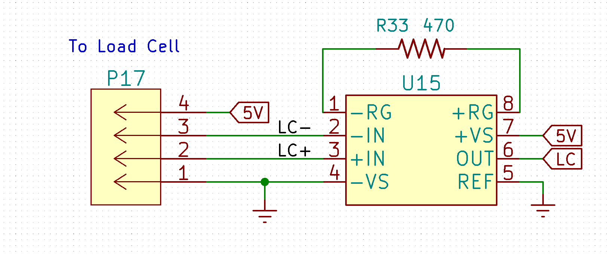

<h1>Liquids Engine Controller</h1>

Current PCB Revision: 4.0

PCB Part Number: L0002

The Liquid Engine Controller is the main embedded processor of Sun Devil Rocketry's Liquid Engine. As the brains of the engine, the controller is responsible for executing propellant feed sequences semi-autonomously, logging sensor data, and transitting engine telemetry. The controller is equipped with an STM32 ARM Cortex M7 processor and 4Mb of external flash for data logging. The board includes a micro-SD card jack for easy access to the logged data. The board includes many power sources for flexible use of the controller during testing and normal operation. These include a 12V power jack, a USB Type B connector, and a 2-pin male pin header. The board includes short circuit protect on the main power rail and regulates the multiplexed supply to 5V and 3.3V with a buck converter and linear regulator (LDO) respectively. The board interfaces with a PC through either the USB port or the 8-pin telemetry connector, which allows wireless transciever modules with either a UART or SPI interface to be connected. The screw terminals on the board connect to the ignition circuitry. An e-match is used to initiate combustion, and two continuity wires are used to provide the controller feedback on the ignition state. The ignition current is routed through an additional screw terminal which serves as a safety/arming switch. The board interfaces with all of the engine sensors, including eight pressure transducers, a thermocouple, and a load cell. The pressure transducer outputs are amplified with a programmable-gain instrumentation amplifier, which allows for up to 256 calibration settings. The thermcouple output is processed using a cold-juntion compensation IC. Additionally, the board includes a reset button and several LEDs for visual indication of power and firmware status.

<b>Working Directory Structure:</b>

   doc: documentation
   
   src: source design files, e.g. schematic and PCB layout files

   lib: libraries for schematic symbols and footprints

   production: files needed for pcb fabrication, e.g. gerbers, profile, drill file

   sim: simulation models/files 

   cad: 3d models
  
   img: images of circuit/footprints for github display 

<h2>3D Model: </h2>

<h2>Schematic: </h2>

<h3>Microcontroller:</h3>

<h3>5V Buck Converter: </h3>

<h3>3.3V Linear Regulator: </h3>

<h3>SD Card: </h3>

<h3>USB: </h3>

<h3>Ignition: </h3>

<h3>Pressure Transducer Programmable Amplifier: </h3>

<h3>Thermocouple Cold Junction Compensation: </h3>

<h3>Load Cell Amplifier: </h3>

